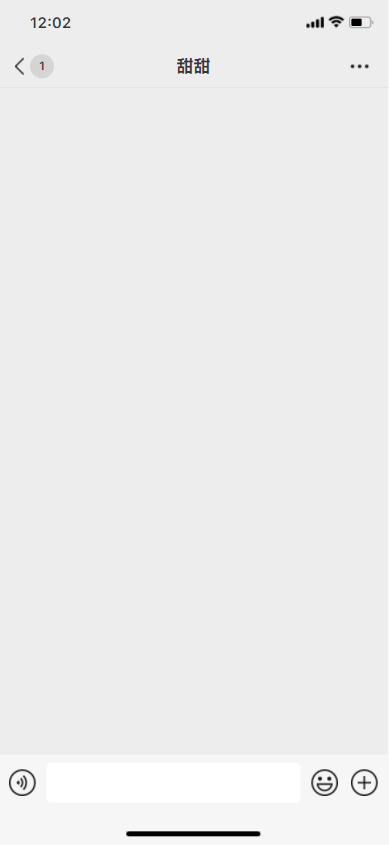
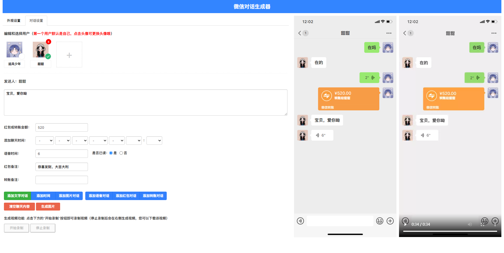
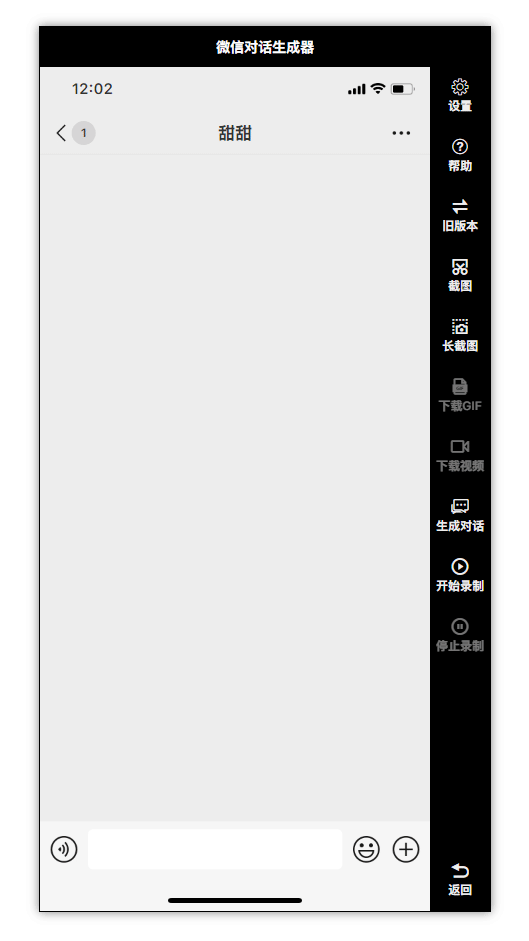
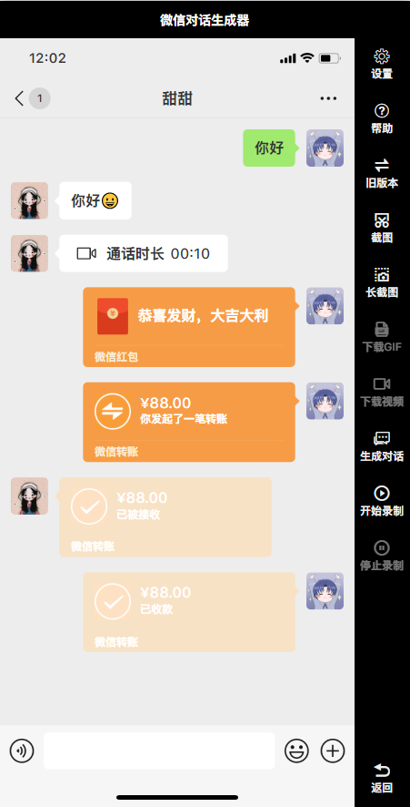
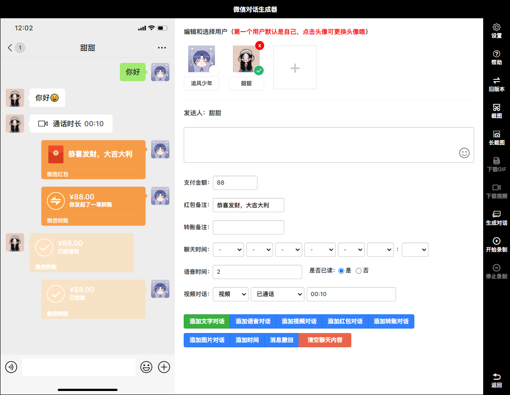

<h1 align="center">微信对话生成器</h1>

<h4 align="center">在线微信对话生成器，是一款在线微信聊天对话制作的工具，可以添加不同用户角色进行对话，支持发送文字、语音、图片、红包、转账等</h4>
<h4 align="center">用来装逼 OR 制作抖音幽默段子还是不错的，可谓是一款娱乐制作神器</h4>
<div align="center">

[](https://gitee.com/lifeixue/weixin-chat)  [](https://gitee.com/lifeixue/weixin-chat)  []()

```shell
注意：此版本为基础版，高级版暂不对外开放
```
------------------------------------------------------------------------
</div>

<h1 align="center">基础版</h1>

## 在线微信聊天生成器，抖音微信聊天搞笑视频制作神器

## 更新日志
2023-01-05：修复年份选项问题，增加年份选项到2027  
2023-01-05：新增生成图片功能（该功能需要将项目部署在服务器上）  
2023-01-05：新增生成视频功能（该功能需要将项目部署在服务器上）  
2023-01-07：成品（解决无法右击保存生成好的图片）  
2023-01-07：成品（添加菜单栏刷新功能,用于解决录制视频后需重启才能二次录制的问题）  
2023-01-09：新增生成GIF功能  
控制发送间隔时间（待开发）  
高清录制MP4格式视频功能（待开发）  
### 温馨提示：小白的话建议下载 wxchat-win32-x64.zip 成品，下载解压后鼠标双击 wxchat.exe 运行即可

## 演示图例
  


<h1 align="center">高级版（暂未开放）</h1>

## 功能更强大，界面更简洁，使用更简单

## 高级版功能介绍
新增一键生成对话功能，可以控制聊天发送间隔时间（无需边录制边输入）  
新增高清录制MP4视频功能（可录制高清、超清、蓝光）  
新增长截图功能  
新增发送表情功能  
新增视频通话、语音通话、消息撤回等功能  
新增数据缓存功能，刷新页面/重启软件内容不会丢失  
新增音效功能（发送消息时带音效）  
2023-05-12：新增对话内容修改功能  
2023-05-12：新增拒绝消息功能  
更多功能.....

## 演示图例
  
  


## 特别声明
此软件只用于娱乐使用，切勿用于非法途径，由此产生任何纠纷由使用者本人自己承担，禁止用于各种违法犯罪行为！！